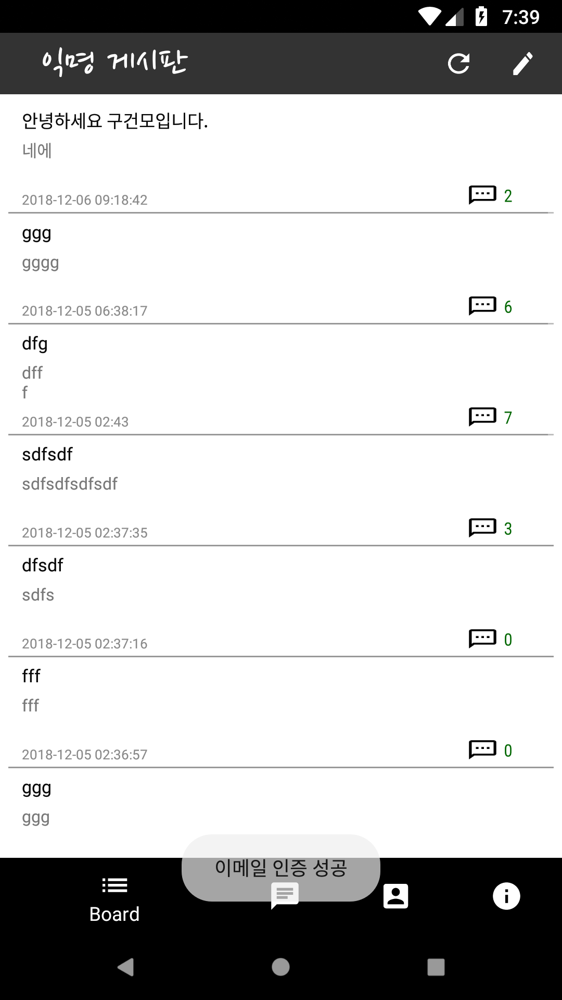

컴퓨터과학과 자유게시판
=====================
### 2018년 2학기 소프트웨어공학 프로젝트
*****
#### 1. 개요
##### 1.1 제목 : 컴퓨터과학과 자유게시판
##### 1.2 개요
    현재 컴퓨터과학과의 모든 학생이 소통할 수 있는 공간은 존재하지 않는다. 모든 학생은 각 학년의 단톡방에 들어와 있으며
    단톡방에서 올라오는 공지만을 읽는다. 
    
    하지만 외국인 학생 또는 편입, 복수전공, 부전공, 복학생 학생들은 단톡방에 없는 경우 또한 있다. 지금 이 현상이 학생회의
    공지를 전달하기에는 불편하지 않지만, 학생이 직접 공지를 해야 할 때는 여간 불편한 게 아니다. 예를 들어 공부두레, 러닝
    코어, e스포츠 대회의 구성원들을 구할 때는 컴과 전체를 대상으로 공지를 해야 하나 자기가 속한 단톡방에 한하기 때문에 
    구성원들을 잘 구할 수 없기 때문이다. 
    
    그러므로 편입, 복수전공, 부전공, 복학생 아울러 모든 학년의 학생들이 소통할 수 있는 게시판이 지금 우리한테 필요하다.

#### 2. 설계

#### 3. 완성작
     

    
