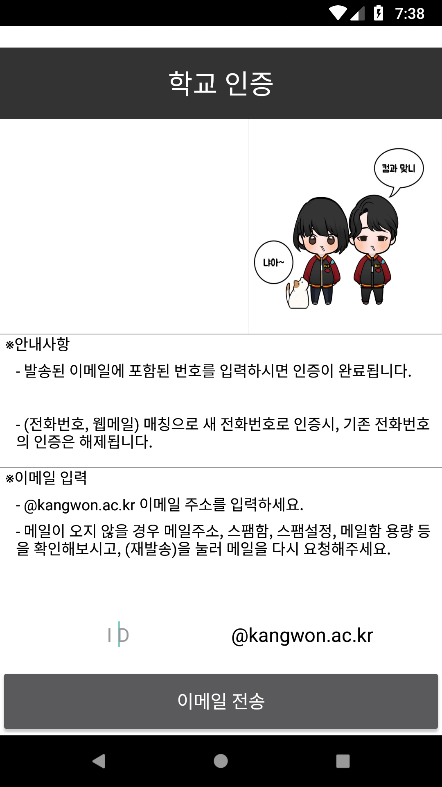
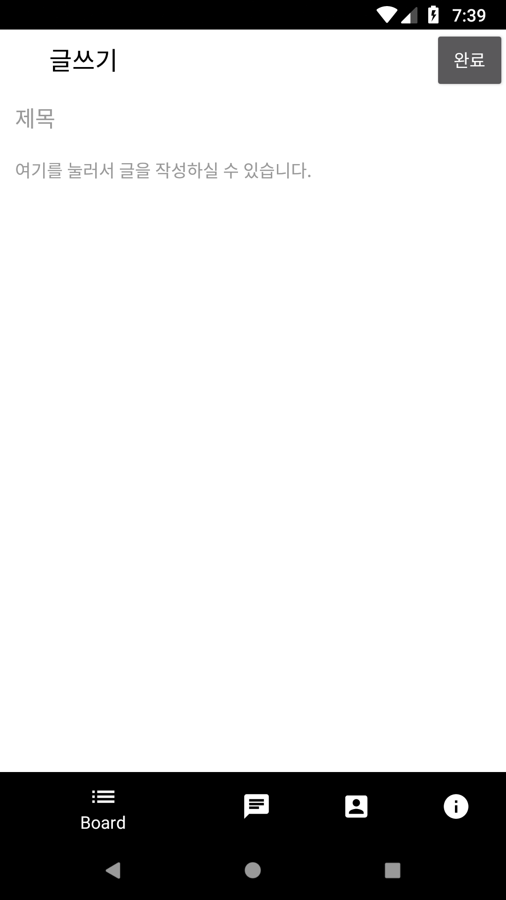
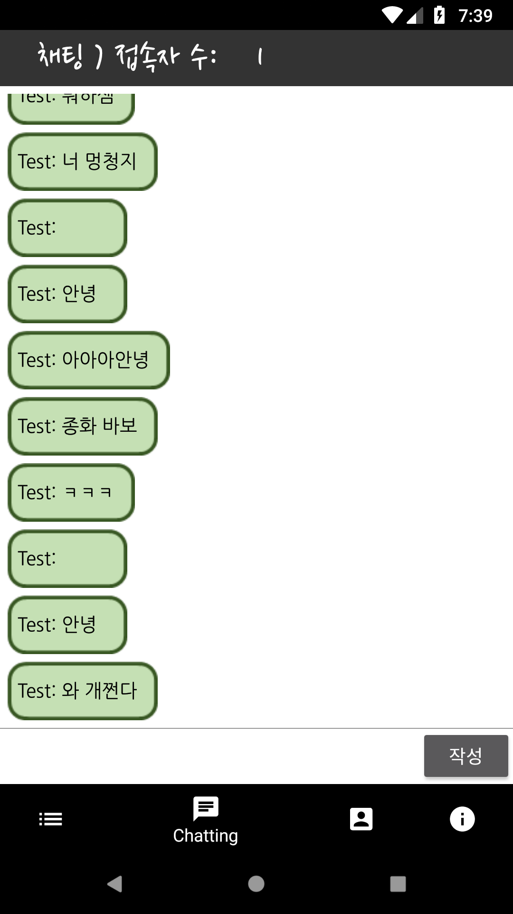

컴퓨터과학과 자유게시판
=====================
### 2018년 2학기 소프트웨어공학 프로젝트
*****
#### 1. 개요
##### 1.1 제목 : 컴퓨터과학과 자유게시판
##### 1.2 개요
    현재 컴퓨터과학과의 모든 학생이 소통할 수 있는 공간은 존재하지 않는다. 모든 학생은 각 학년의 단톡방에 들어와 있으며
    단톡방에서 올라오는 공지만을 읽는다. 
    
    하지만 외국인 학생 또는 편입, 복수전공, 부전공, 복학생 학생들은 단톡방에 없는 경우 또한 있다. 지금 이 현상이 학생회의
    공지를 전달하기에는 불편하지 않지만, 학생이 직접 공지를 해야 할 때는 여간 불편한 게 아니다. 예를 들어 공부두레, 러닝
    코어, e스포츠 대회의 구성원들을 구할 때는 컴과 전체를 대상으로 공지를 해야 하나 자기가 속한 단톡방에 한하기 때문에 
    구성원들을 잘 구할 수 없기 때문이다. 
    
    그러므로 편입, 복수전공, 부전공, 복학생 아울러 모든 학년의 학생들이 소통할 수 있는 게시판이 지금 우리한테 필요하다.

#### 2. 설계

#### 3. 완성작
     

    

#### 4. 끝마치며

처음 시작은 분명 간단한 게시판 앱으로 시작했습니다만... 게시판만 떡하니 있으니 노력한 시간에 비해 결과물이 초라해보이는 결과가 ㅠㅜ 
결국, 이거저거 추가하다보니 기능이 많아졌습니다. 라이브러리 하나 없이 하드 코딩으로 구현했다는 것이 함정 :sad:

C언어로 계산기 같은거 만들다가 Java로 앱을 만드니 매우 재밌던 경험이였습니다. 또한 처음으로 Web Application Server, DB Server도 구현해봤습니다. 인터넷으로 통신을 한다는 거 자체가 굉장히 신기한 경험...

교수님이 좀 만 더 다듬으면 과에서 진짜 써도 될 것 같다고 하셨습니다 ㅋㅋ. 물론 듣기 좋으라고 한 말이였지만 기분은 매우 좋았습니다.
